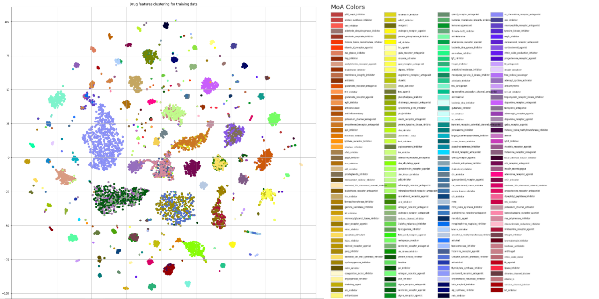

# Mechanisms of Action (MoA) Prediction for CMAP
## Additive angular margin and autoencoder based MoA prediction models.

These models was developed in the MoA Prediction contest hosted by Kaggle.
Via moa-camp.ipynb, drugs' clustering map for MoA can be checked in the case the additive margin loss was used.

[Kaggle's MoA Prediction Contest](https://www.kaggle.com/c/lish-moa)

## Status
First release. According to keras_unsupervised 1.1.13.dev1, these models will be modified.

